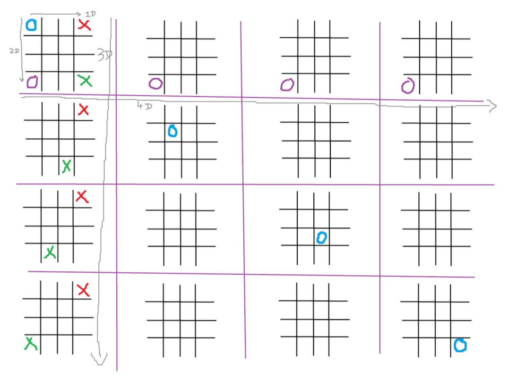
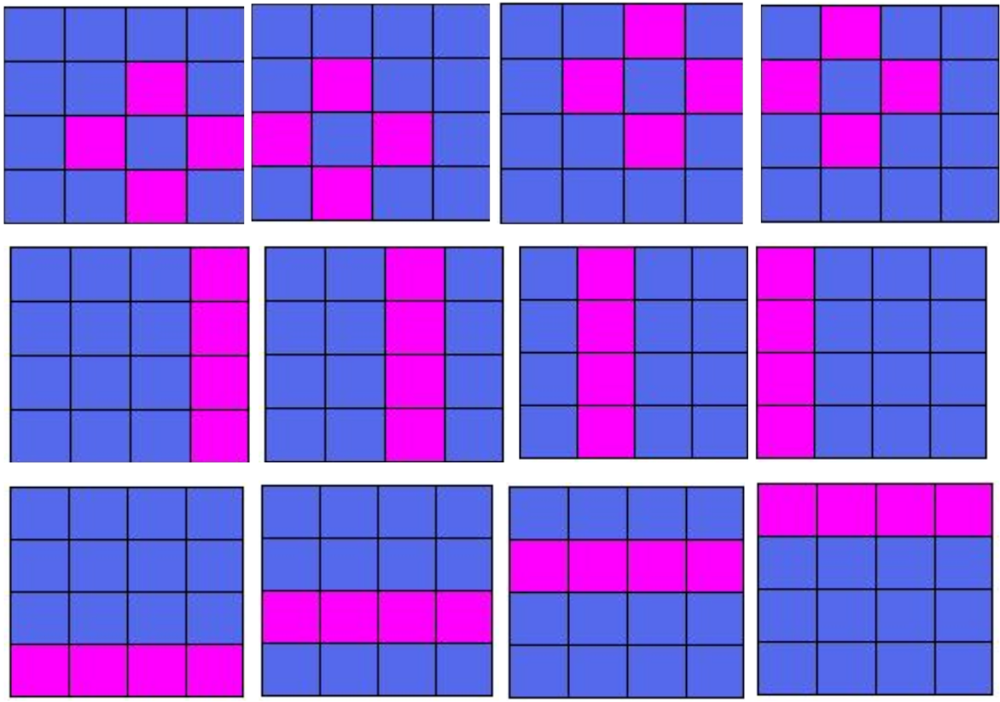

# Extreme-Tic-Tic-Toe-Bot
Game playing agent for the 4x4x4x4 Tic Tac Toe Game

### Board
It is a 4x4x4x4 board, which looks like this

* The Extreme TicTacToe is an extension of 4x4 TicTacToe which in turn is an extension of standard 3x3 TicTacToe. Extreme TicTacToe comprises of a 4x4 board in which each cell further is a 4x4 board.
* The game is between two teams.
* Coin is flipped to choose who will move first.
* Player 1 marks ‘x’ and Player 2 marks ‘o’ on the board.
* The player who makes a legitimate pattern wins the whole board.

Note: This is an extension of [Ultimate tic tac toe](https://mathwithbaddrawings.com/2013/06/16/ultimate-tic-tac-toe/)

### Rules

The board structure is as shown above. We will refer to the whole board as BigBoard and each small board as SmallBoard from now on. Hence, each cell of BigBoard is a SmallBoard and SmallBoard itself has 16 cells.

* FIRST MOVE: ​ The first player takes the first move and it is a free move. The player is free to move anywhere i.e. in any cell of any SmallBoard.
* CORRESPONDENCE RULE: ​ When a player places his marker in any of the cell, the next player can only place marker in a SmallBoard corresponding to that cell. For  xample: If a player places his marker in Top Right Corner cell of a SmallBoard then the next player can only place his marker in available cells of the Top Right Corner SmallBoard.
* ABANDON RULE: ​ Once a SmallBoard is won by some player, that SmallBoard is abandoned and it has to be considered full, i.e. no more markers can be placed in that SmallBoard.
* OPEN MOVE: ​ In case all the cells of the destined SmallBoard from “Correspondence Rule” are occupied or if the the destined SmallBoard is abandoned according to “Abandon Rule”, then the move is considered to be an open move, i.e. the player can move anywhere, on any available cell of any SmallBoard, given that SmallBoard is not abandoned.
* BONUS MOVE: ​ If a player places his marker in a cell of a SmallBoard and this leads to the player winning that SmallBoard, then the he/she gets a bonus move, i.e., he/she gets to move again. This bonus move is limited to 2 SmallBoard wins, i.e., If you win another SmallBoard by placing the marker again in your bonus move, you don’t get another bonus move.
* WIN RULE: ​ The player who places their markers on 4 cells of a SmallBoard such that they form a vertical or horizontal line or 4 cells such that they form a diamond win that SmallBoard. Similarly, player who wins 4 SmallBoards such that they form a vertical or horizontal line or win 4 SmallBoards such that they form a diamond win the whole game.

### Winning combinations:

### Usage
python simulator.py < option >

The option can be -->

* 1 => Human vs. Computer
* 2 => Computer vs. Random Player
* 3 => Human vs. Random Player
* 4 => Human vs. Human
* 5 => Computer vs Computer
